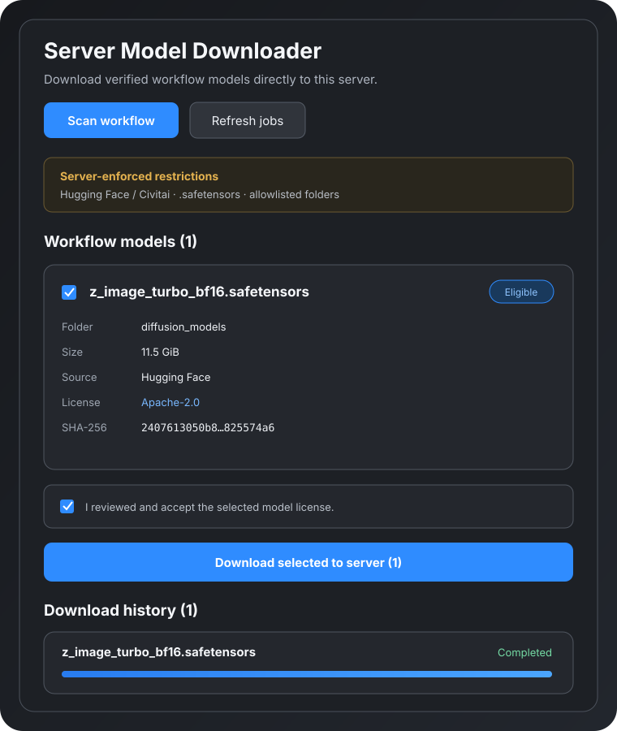

# Server Model Downloader for ComfyUI

[](https://github.com/MacroXie04/comfyui-server-model-downloader/actions/workflows/ci.yml)
[](https://github.com/MacroXie04/comfyui-server-model-downloader/actions/workflows/codeql.yml)
[](LICENSE)

Server Model Downloader is a security-focused ComfyUI extension that downloads missing workflow models directly to the machine running ComfyUI. It resolves provider metadata, reserves disk space, resumes interrupted transfers, verifies SHA-256 and Safetensors structure, then publishes each file without overwriting an existing model.

The extension is **disabled by default**. It becomes available only after an administrator configures an HTTPS public origin and one of the supported authentication modes.



## Highlights

- Explicit **Scan workflow** action; opening the sidebar never contacts a model provider.
- Canonical Hugging Face and Civitai HTTPS sources only.
- `.safetensors` files and a fixed model-directory allowlist only.
- Cloudflare Access JWT validation or an explicitly trusted reverse proxy.
- Identity-bound CSRF and short-lived download tokens.
- Resumable downloads with aggregate capacity checks and a 20 GiB reserve.
- SHA-256 and Safetensors validation before descriptor-bound, no-replace publication.
- Retry handling for timeouts, rate limits, and transient upstream failures.
- Download history, cancellation, and safe removal of retained partial files.
- No separate listener or inbound port: the API is served by the existing ComfyUI process.

## Compatibility

| Component | Supported |
| --- | --- |
| Operating system | Linux only |
| Python | 3.10–3.13 |
| ComfyUI | 0.33.1 or newer |
| ComfyUI frontend | 1.48.7 or newer |
| ComfyUI processes | One process per state/model directory |
| Providers | Hugging Face, Civitai |
| Model format | `.safetensors` |

Linux is required for `flock`, `linkat`, `O_NOFOLLOW`, and descriptor-bound publication. The downloader fails closed when those guarantees are unavailable.

## Installation

After the Registry release is available, install with Comfy CLI:

```bash
comfy node install server-model-downloader
```

Or clone the repository into `custom_nodes` and install its runtime dependencies in the same Python environment as ComfyUI:

```bash
cd /path/to/ComfyUI/custom_nodes
git clone https://github.com/MacroXie04/comfyui-server-model-downloader.git
/path/to/ComfyUI/.venv/bin/python -m pip install -r comfyui-server-model-downloader/requirements.txt
```

Restart ComfyUI after configuring the extension.

## Configuration

Every deployment must set `SMD_ENABLED=true`, an exact HTTPS origin, and one authentication mode. Invalid or incomplete configuration leaves only the downloader in a degraded `503` state; ComfyUI itself continues to run.

| Variable | Required | Default | Purpose |
| --- | --- | --- | --- |
| `SMD_ENABLED` | Yes | `false` | Enables the downloader when set to `true`. |
| `SMD_PUBLIC_ORIGIN` | Yes | — | Exact root origin, for example `https://comfy.example.com`. Paths, queries, fragments, credentials, and HTTP are rejected. |
| `SMD_AUTH_MODE` | Yes | — | `cloudflare-access` or `trusted-proxy`. |
| `SMD_MODELS_ROOT` | No | ComfyUI `folder_paths.models_dir` | Overrides the model root. |
| `SMD_STATE_DIR` | No | ComfyUI system user directory plus `server_model_downloader` | Overrides private persistent state. |
| `SMD_ALLOWED_EMAILS` | No | all authenticated identities | Comma-separated email allowlist. |
| `SMD_CF_TEAM_DOMAIN` | Cloudflare | — | Cloudflare Access team domain, such as `example.cloudflareaccess.com`. |
| `SMD_CF_AUDIENCE` | Cloudflare | — | Access application AUD tag. |
| `SMD_TRUSTED_PROXY_CIDRS` | Trusted proxy | `127.0.0.0/8,::1/128` | Comma-separated proxy source networks allowed to assert identity. |
| `SMD_TRUSTED_IDENTITY_HEADER` | Trusted proxy | `X-Forwarded-User` | Header overwritten by the trusted proxy with the authenticated identity. |
| `HF_TOKEN` | No | — | Server-side token for private or gated Hugging Face files. |
| `HUGGING_FACE_HUB_TOKEN` | No | — | Alternative to `HF_TOKEN`. |
| `CIVITAI_API_TOKEN` | No | — | Server-side token for Civitai downloads that require one. |

`SMD_STATE_DIR` contains resumable job state and signing material. Keep it persistent, mode `0700`, writable only by the ComfyUI service account, and out of source control. Provider credentials must be service environment variables, never workflow URLs or browser storage.

### Cloudflare Access

Cloudflare Access is the recommended production mode:

```ini
[Service]
Environment="SMD_ENABLED=true"
Environment="SMD_PUBLIC_ORIGIN=https://comfy.example.com"
Environment="SMD_AUTH_MODE=cloudflare-access"
Environment="SMD_CF_TEAM_DOMAIN=example.cloudflareaccess.com"
Environment="SMD_CF_AUDIENCE=your-access-application-aud"
Environment="SMD_ALLOWED_EMAILS=operator@example.com"
```

The backend validates the `Cf-Access-Jwt-Assertion` signature and its issuer, audience, expiry, not-before time, and key ID. Signing keys are obtained from the team JWKS endpoint and rotated safely. Missing keys or a JWKS outage fail closed.

The Access application must cover the entire ComfyUI hostname, including both downloader API prefixes. Do not add a bypass policy for downloader routes.

### Trusted reverse proxy

Use this mode only when a local reverse proxy authenticates the user, strips any client-supplied identity header, and writes its own value:

```ini
[Service]
Environment="SMD_ENABLED=true"
Environment="SMD_PUBLIC_ORIGIN=https://comfy.example.com"
Environment="SMD_AUTH_MODE=trusted-proxy"
Environment="SMD_TRUSTED_PROXY_CIDRS=127.0.0.0/8,::1/128"
Environment="SMD_TRUSTED_IDENTITY_HEADER=X-Forwarded-User"
```

Requests from outside the configured proxy networks are rejected even if they contain the identity header. Never include a public client network in `SMD_TRUSTED_PROXY_CIDRS`.

## Usage

1. Open a workflow that contains model metadata.
2. Open **Extensions → Server Model Downloader**, or select its sidebar icon.
3. Choose **Scan workflow**. This is the first point at which provider metadata is requested.
4. Review the immutable revision, destination, size, SHA-256, source, and license.
5. Select eligible models, confirm their licenses, and choose **Download selected to server**.
6. Monitor connecting, downloading, retrying, hashing, validating, publishing, and cancellation phases in the history panel.

Failed and cancelled downloads retain their partial files for a future resume. Use **Discard partial** when the retained data is no longer wanted.

ComfyUI's built-in missing-model links may download through the browser. Use this extension's sidebar when a verified file should be written on the server.

## Supported destinations

Only the following subdirectories beneath the effective ComfyUI model root are allowed:

```text
checkpoints
diffusion_models
text_encoders
clip
clip_vision
vae
loras
controlnet
upscale_models
embeddings
audio_encoders
style_models
```

Version 1 does not write to paths declared only in `extra_model_paths.yaml`.

## API

ComfyUI exposes the same authenticated API under both prefixes:

```text
/server-model-downloader/*
/api/server-model-downloader/*
```

Key endpoints are:

| Method | Path | Description |
| --- | --- | --- |
| `GET` | `/health` | Authenticated readiness and degraded-state details. |
| `GET` | `/session` | CSRF token, expiry, capabilities, version, and minimal identity. |
| `POST` | `/inspect` | Resolve up to 50 workflow model records. |
| `POST` | `/jobs` | Create jobs from signed download tokens. |
| `GET` | `/jobs?limit=50&cursor=…` | Newest-first, cursor-paginated history. |
| `GET` | `/jobs/{id}` | Read a single job. |
| `POST` | `/jobs/{id}/cancel` | Request cancellation. |
| `DELETE` | `/jobs/{id}/partial` | Remove a retained partial file for a failed or cancelled job. |

All endpoints require authentication. Mutating methods additionally require an identity-bound `X-SMD-CSRF` token and a matching HTTPS `Origin`. Errors use `{ "error", "code", "request_id" }`; logs and responses do not expose JWTs, provider credentials, download tokens, absolute paths, or upstream response bodies.

See [`docs/openapi.yaml`](docs/openapi.yaml) and [`frontend/README.md`](frontend/README.md) for the complete browser contract.

## Security model

The browser is not trusted to choose a destination path, resolved URL, checksum, or revision. Inspection returns a short-lived token binding the authenticated identity to server-resolved metadata. Job creation accepts that token rather than arbitrary paths or URLs.

The main threats and controls are:

| Threat | Control |
| --- | --- |
| Unauthenticated API use | Access JWT or trusted-proxy identity validation on every endpoint. |
| Cross-site mutation | Exact HTTPS origin plus identity-bound, expiring CSRF token. |
| SSRF and malicious redirects | Canonical provider URLs, public-IP DNS checks, and redirect revalidation. |
| Path traversal or symlink replacement | Directory allowlist, descriptor-relative operations, `O_NOFOLLOW`, and locks. |
| Corrupt or disguised content | Provider size/SHA metadata, SHA-256, and Safetensors parser validation. |
| Existing-model replacement | No-replace publication with descriptor-bound `linkat`. |
| Disk exhaustion | Aggregate reservation accounting and a 20 GiB free-space reserve. |
| Multiple writers | State-directory singleton lock and per-target filesystem locks. |
| Stale browser responses | AbortController cancellation plus request-generation checks. |

Read [`SECURITY.md`](SECURITY.md) before operating the extension on an Internet-reachable hostname.

## Troubleshooting

### The panel reports that the downloader is disabled or degraded

Check `/health` while authenticated and inspect the ComfyUI log. Confirm all required environment variables are present, the configured origin contains no path, and the service account can write the models and state directories.

### Authentication fails behind Cloudflare Access

Confirm the request includes the Access assertion, the team domain and application AUD match the dashboard, the system clock is correct, and no tunnel rule bypasses Access. A JWKS outage intentionally blocks the downloader.

### Trusted-proxy identity is rejected

Confirm ComfyUI sees the proxy's actual source address, that address is inside `SMD_TRUSTED_PROXY_CIDRS`, and the proxy overwrites the configured identity header.

### A model is not discovered

The scanner uses active node widget selections and workflow model metadata. Disabled and bypassed nodes are ignored. Metadata that exists only inside a promoted subgraph input may need to be exposed at the workflow root.

### A partial file remains

This is expected after cancellation or a retryable failure. Resume by submitting the same resolved model again, or use **Discard partial** after the job reaches `failed` or `cancelled`.

## Development

```bash
python -m pip install -r requirements-dev.txt
python -m pytest --cov=backend --cov-branch backend/tests
ruff check backend
ruff format --check backend
npm test
npm run check
```

CI runs on Ubuntu with Python 3.10–3.13 and Node 20/22. See [`CONTRIBUTING.md`](CONTRIBUTING.md) for contribution and release requirements.

## License

Licensed under the [Apache License 2.0](LICENSE).
